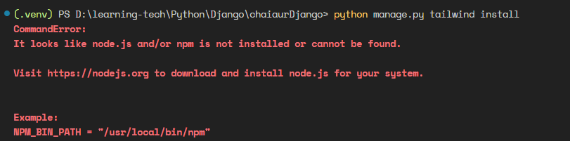

# Create a Django project

`django-admin startproject chaiaurDjango`

# Run

`cd chaiaurDjango`
`python manage.py runserver OR python manage.py runserver 9000`

# Install tailwind and run app with below cammand

`python manage.py tailwind install`

- if get this error

- here is a solution

`NPM_BIN_PATH = 'npm.cmd'` put this line in settings.py

# Start tailwind with this cammand `python manage.py tailwind start`
